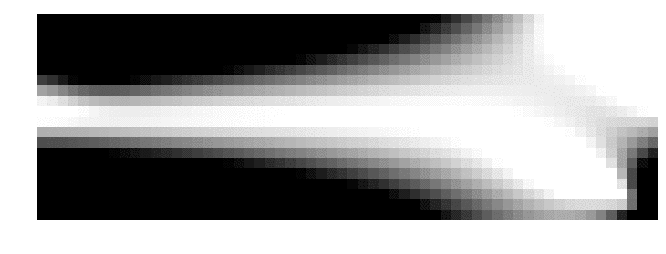

# ToPy


ToPy is a lightweight topology optimization framework for Python. It was originally hosted on Google Code, please refer to the [ToPy wiki](https://github.com/williamhunter/topy/wiki)

## Installation
All you need is the following:

```bash
$ git clone https://github.com/williamhunter/topy
$ cd topy/topy
$ python setup.py install
```

## Initialization
The main class of **ToPy** is `Topology`. It definess the main constraints, grid and parameters of optimization. There are 2 ways how you could define the `Topology`:
- TPD file. It is usefull for comand line 
- Config dictionary. This is quite close to TPD file. However, it is a way useful if the initialization in code is needed.

### TPD (ToPy Definition)
There is a minimal set of parameters, which is required for successful definition of the problem:
```
PROB_TYPE  : comp 
PROB_NAME  : mbb_beam_minimal
ETA        : 0.5 
DOF_PN     : 2
VOL_FRAC   : 0.5
FILT_RAD   : 1.5
P_FAC      : 3
ELEM_K     : Q4
NUM_ELEM_X : 60
NUM_ELEM_Y : 20
NUM_ELEM_Z : 0
NUM_ITER   : 10 
FXTR_NODE_X: 1|21 
FXTR_NODE_Y: 1281 
LOAD_NODE_Y: 1
LOAD_VALU_Y: -1
```
You can read more about successful problem definition [here](https://github.com/williamhunter/topy/tree/master/templates).

When the `.tpd` file is defined, then the rest is simple:

```python
from topy import Topology

topology = Topology()
topology.load_tpd_file('file.tpd')
```

### Config dictionary
First you have to define a config dictionary:

```Python
config = {
     'DOF_PN': 2,
     'ELEM_K': 'Q4',
     'ETA': '0.5',
     'FILT_RAD': 1.5,
     'FXTR_NODE_X': range(1, 21),
     'FXTR_NODE_Y': 1281,
     'LOAD_NODE_Y': 1,
     'LOAD_VALU_Y': -1,
     'NUM_ELEM_X': 60,
     'NUM_ELEM_Y': 20,
     'NUM_ELEM_Z': 0,
     'NUM_ITER': 94,
     'PROB_NAME': 'beam_2d_reci',
     'PROB_TYPE': 'comp',
     'P_FAC': 3.0,
     'VOL_FRAC': 0.5
}
```
The requirements are the same as for `.tpd` file. 

```Python
topology = Topology(config=config)
```
## Optimization

You can use one-line solution:

```bash
$ python topy/scripts/optimise.py <filename>.tpd
```

Or with script:

```Python
import topy

config = {...}
t = topy.Topology(config)
t.set_top_params()
topy.optimise(t)
```

## Visualization
Module `topy.visualization` allows one to save the output as a `.png` image for 2D problems or as a `.vtk` file for 3D. You can animate the obtained images with [convert](https://www.imagemagick.org/script/convert.php) tool.

```bash
convert -delay 35 *.png anim.gif
```

<div align="left">	
	
	
	
</div>
